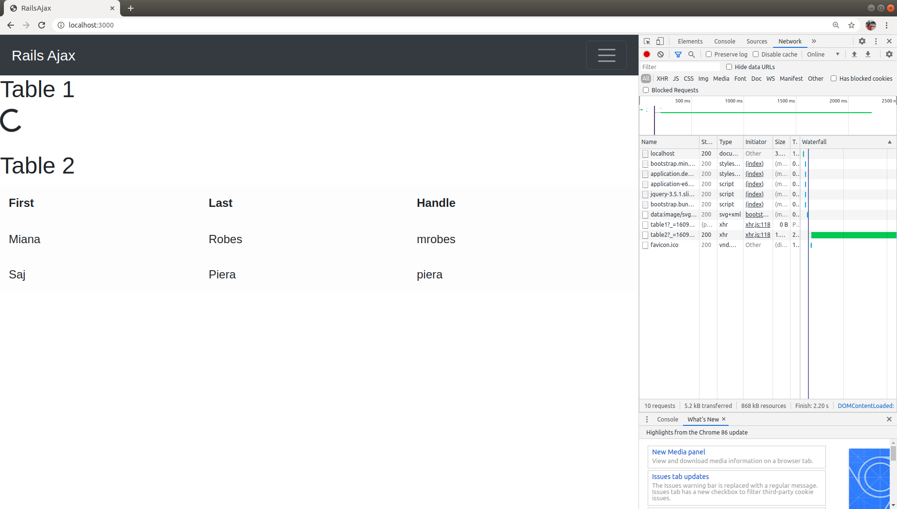

# rails_ajax

Demo project to familiarize with ajax in rails. In this project, example shown how to render table based on data send by server. I added sleep time before sending data to mimic time taken by server to compute data to send back. This project helped to understand how to load page without waiting for all components to be rendered.

## Inital Page Load

## Second Table Rendered

## First Table Rendered

## References

- https://api.jquery.com/jquery.ajax/
- https://www.botreetechnologies.com/blog/introducing-jquery-in-rails-6-using-webpacker/

## TODO

There is surely better way to use ajax with rails. I find ajax a bit complicated to use so I will use this method as a starting point and enhance further on this.
